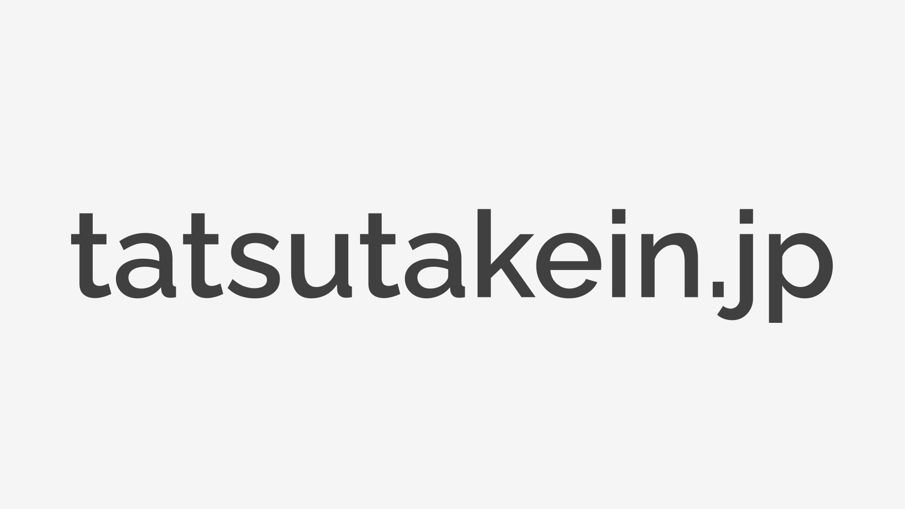

# tatsutakein.jp

https://tatsutakein.jp

## Tech Stacks

### [Turborepo](https://turbo.build/repo)

### [Next.js](https://nextjs.org/)

### [Tailwind CSS](https://tailwindcss.com/)

## GetStarted

以下の手順を踏んで開発に参加しましょう。

### 1. Bootstrap

以下のコマンドを実行して開発環境を整えます。

```shell
$ make bs
```

### 2. `bun run dev`

`bun run dev`でローカルサーバーを立ち上げます。  
表示された URL にアクセスすると、サイトが表示されます。

```shell
$ bun run dev
```

## License

This software is provided under the [MIT License](LICENSE).
