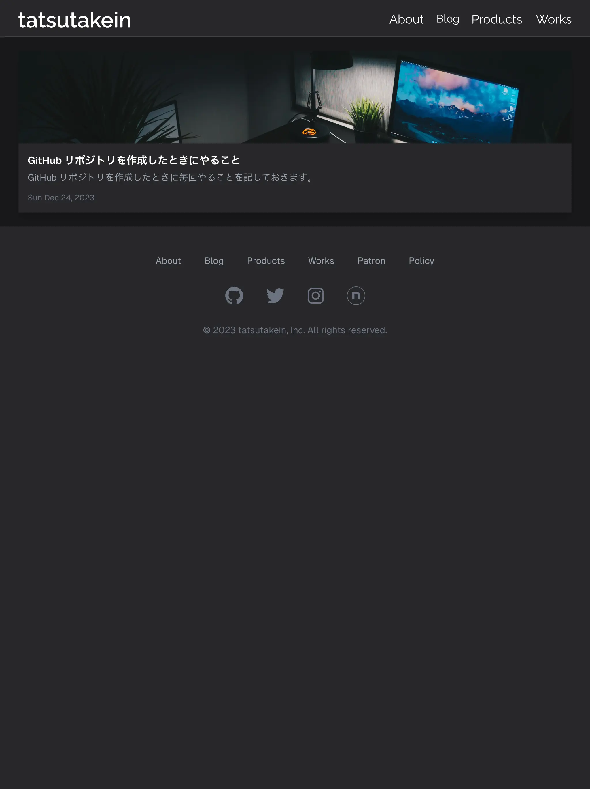
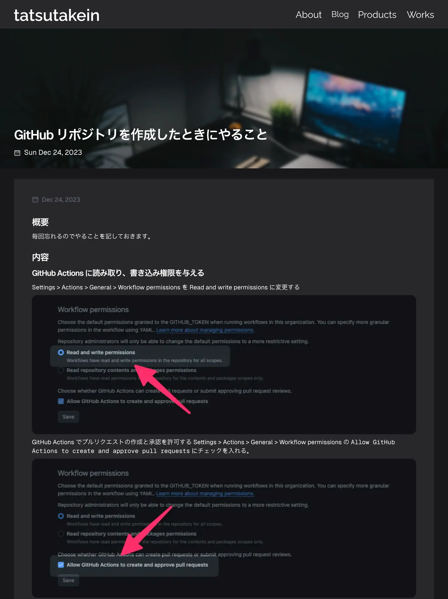

[](https://opensource.org/licenses/MIT)
[](https://app.renovatebot.com/dashboard)


# tatsutakein.jp


My personal website is a testing ground, so to speak, and is seemingly over-specified in its configuration. It serves as
an app-like-web platform for my writings, self-introduction, showcasing my bookmarks, and more.

## Features

On my personal website you can browse articles and check out the products I have developed.

### Screenshots

|                              Home                              |                             Posts                              |                          Post Content                          |
|:--------------------------------------------------------------:|:--------------------------------------------------------------:|:--------------------------------------------------------------:|
|  |  |  |

## Get Started

After git clone, run the following command

```shell
$ make bs
```

What is being processed by bootstrap is shown below.

- Configuring git commit message templates
- Installation of various tools by mise
- Installation of dependencies by bun
- Installation of husky by bun

### Add template

You can generate code from a template using plop by executing the following command.

```shell
$ bun plop
```

## Development Environment

TBD

## Architecture

- [Turborepo](https://turbo.build/repo)
- [Next.js](https://nextjs.org/)
- [Tailwind CSS](https://tailwindcss.com/)

## Build

TBD

## Testing

TBD

## Performance

TBD

## Contributors

Thanks to our wonderful contributors!

<a href="https://github.com/tatsutakein/tatsutakein.jp/graphs/contributors">
  
</a>

## Repo Activity


## License

tatsutakein.jp is distributed under the terms of the MIT License. See the [license](LICENSE) for more
information.
